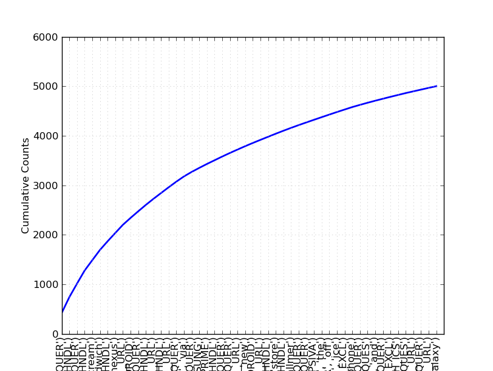
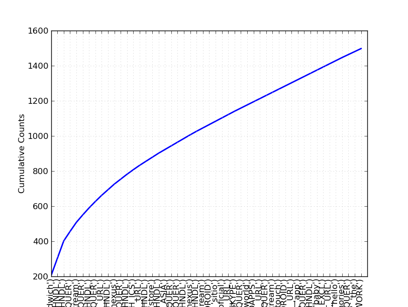

SENTIMENT ANALYSIS OF TWITTER FEEDS  
===================================
  
DEPARTMEMT OF MATHEMATICS  
-------------------------
INDIAN INSTITUTE OF TECHNOLOGY, DELHI  
-------------------------------------  
  
  
  
  
  
  
  

###  Yogesh Garg  

###  Dr. Niladri Chatterjee  

### January, 2014

##  1  Introduction

###  1.1  Sentiment Analysis

There are two type of user-generated content available on the web – facts and
opinions. Facts are statements about topics and in the current scenario,
easily collectible from the Internet using search engines that index documents
based on topic keywords. Opinions are user specific statement exhibiting
positive or negative sentiments about a certain topic. Generally opinions are
hard to categorize using keywords. Sentiment Analysis refers to the use of
text analysis and natural language processing to identify and extract
subjective information in textual contents. Sentiment Analysis finds its
application in a variety of domains:

**Business**
     Businesses may use sentiment analysis on blogs, review websites etc. to judge the market response of a product. This information may also be used for intelligent placement of advertisements. For example, if product A and B are competitor and an online merchant business M sells both, then M may advertise for A if the user displays positive sentiments towards A, its brand or related products, or B if they display negative sentiments towards A. 
**Government**
     Governments and politicians can actively monitor public sentiments as a response to their current policies, speeches made during campaigns etc. This will help them make create better public awareness regarding policies and even drive campaigns intelligently. 
**Financial Markets**
     Public opinion regarding companies can be used to predict performance of their stocks in the financial markets. If people have a positive opinion about a product that a company A has launched, then the share prices of A are likely to go higher and vice versa. Public opinion can be used as an additional feature in existing models that try to predict market performances based on historical data. 

###  1.2  Twitter

Twitter is an online social networking and micro-blogging service that enables
users to create and read short messages, called "tweets". It is a global town
center with the presence of eminent personalities from the field of
entertainment, industry and politics. People tweet about their life, events
and express opinion about various topics using text messages limited to 140
characters. Registered users can read and post tweets, but any unregistered
users can read them. Twitter can be accessed via Web, SMS, or mobile apps.
Traditionally a large volume of research in sentiment analysis and opinion
mining has been directed towards larger pieces of text like movie reviews.
From the perspective of Sentiment Analysis, we discuss a few characteristics
of Twitter:

**Length**
     The maximum length of a Twitter message is 140 characters. This means that we can practically consider a tweet to be a single sentence, void of complex grammatical constructs. Which, as described earlier, is a vast difference from traditional subjects of Sentiment Analysis, such as movie reviews. 
**Language model**
     Twitter is used via a variety of media including SMS and mobile phone apps. Because of this and the 140-character limit, language used in Tweets tend be more colloquial, and filled with slang and misspellings, as compared to other user-generated content on the web. Use of Hashtags also gained popularity on Twitter and is a primary feature in any given tweet. 
**Data availability**
     Another difference is the magnitude of data available. With the Twitter API, it is very easy to collect millions of tweets for training. There exist a few datasets that have manually labeled the tweets. 
**Domain**
     Twitter is a global town center with the presence of eminent personalities from the field of entertainment, industry and politics. Registered users frequently interact with each other including their friends, strangers and even the eminent personalities. This makes twitter a unique place to model a generic classifier as opposed to domain specific classifiers that could be build on websites such as movie reviews. 

##  2  Methodology

###  2.1  Datasets

One of the major challenges in Sentiment Analysis of Twitter is to collect a
labeled dataset. Researchers have made public the following datasets for
training and testing classifiers.

####  2.1.1  Twitter Sentiment Corpus

This is a collection of 5513 tweets collected for four different topics,
namely, Apple, Google, Microsoft, Twitter It is collected and hand-classified
by Sanders Analytics LLC [7]. Each entry in the corpus contains, Tweet id,
Topic and a Sentiment label. We use Twitter-Python library to enrich this data
by downloading data like Tweet text, Creation Date, Creator etc. for every
Tweet id. Each Tweet is classified by an American male into the following four
categories.

**Positive**
     For showing positive sentiment towards the topic
**Positive**
     For showing no or mixed or weak sentiments towards the topic
**Negative**
     For showing negative sentiment towards the topic
**Irrelevant**
     For non English text or off-topic comments For showing positive sentiment towards the topic

 
<table border="1">
<tr><td colspan="1" align="center">Tweet </td><td colspan="1" align="center">Classification </td></tr>
<tr><td width="0"><tt>S/O&nbsp;to&nbsp;@apple&nbsp;for&nbsp;replacing&nbsp;my&nbsp;phone&nbsp;for&nbsp;free...</tt> </td><td align="left"><tt>positive</tt> </td></tr>
<tr><td width="0"><tt>+1&nbsp;&nbsp;RT&nbsp;@Doug_Newton:&nbsp;@apple&nbsp;PLEASE&nbsp;FIX&nbsp;#Siri!!!!</tt> ...
    <tt>She&nbsp;can't&nbsp;connect&nbsp;to&nbsp;your&nbsp;network!!!!!!!</tt> </td><td align="left"><tt>negative</tt> </td></tr>
<tr><td width="0"><tt>Apple&nbsp;Users&nbsp;Get&nbsp;The&nbsp;official&nbsp;Kalifornia&nbsp;Cavi&nbsp;App</tt> ...
    <tt>on&nbsp;your&nbsp;Apple&nbsp;Device&nbsp;now&nbsp;on&nbsp;&nbsp;-&nbsp;powered&nbsp;by&nbsp;@Apple</tt> ...
    <tt>-&nbsp;Download&nbsp;it&nbsp;free&nbsp;http://t.co/HlGnvlRw</tt> </td><td align="left"><tt>neutral</tt> </td></tr></table>

Table 1: Classification of Tweets by sentiments expressed in each

####  2.1.2  Stanford Twitter

This is a collection of 100000 tweets labeled 0 (negative), 2 (neutral) or 4
(positive). This data was automatically annotated, not by human. The authors
assume that any tweet with positive emoticon like `:)` were positive and the
tweets with negative emoticon like `:(` were negative [5].

###  2.2  Features

A wide variety of features can be used to build a classifier for tweets. The
most widely used and basic feature set is word n-grams. However, there's a lot
of domain specific information present in tweets that can also be used for
classifying them. Preprocessing is needed to normalise these features.
Relevant preprocessing methods are discussed below.

####  2.2.1  Pre Processing

User-generated content on the web is seldom present in a form usable for
learning. It becomes important to normalise the text by applying a series of
preprocessing steps. In this paper we have applied an extensive set of
preprocessing steps to decrease the size of the feature set to make it
suitable for learning algorithms.

 
<table border="1">
<tr><td align="left">Step </td><td align="left">Number </td><td align="left">Percent    </td></tr>
<tr><td align="left">before preprocessing </td><td align="left">19128 </td><td align="left"></td></tr>
<tr><td align="left">after processing Hashtags </td><td align="left">18649 </td><td align="left">97.50% </td></tr>
<tr><td align="left">after processing Handles </td><td align="left">17118 </td><td align="left">89.49% </td></tr>
<tr><td align="left">after processing Urls </td><td align="left">16723 </td><td align="left">87.43% </td></tr>
<tr><td align="left">after processing Emoticons </td><td align="left">18631 </td><td align="left">97.40% </td></tr>
<tr><td align="left">after processing Punctuations </td><td align="left">13724 </td><td align="left">71.75% </td></tr>
<tr><td align="left">after processing Repeatings </td><td align="left">18544 </td><td align="left">96.95% </td></tr>
<tr><td align="left">after processing All </td><td align="left">11031 </td><td align="left">57.67% </td></tr></table>

Table 2: Number of words before and after pre-processing

We have started by removing the query terms from the text. This is important
so that no particular query word becomes a feature in our classifier. Next we
have removed links, including URLs, Handles and Hashtags. A particular URL is
not important. However, presence of a URL can be an important feature for
classification. We give below a description of some popular features present
in tweet text.

**Hashtags**
    A hashtag is a word or an un-spaced phrase prefixed with the hash symbol (#) These are used to both naming subjects and phrases that are currently in trending topics. For example, `#iPad`, `#news`
**Handles**
    Every Twitter user has a unique username. Any thing directed towards that user can be indicated be writing their username preceded by . Thus, these are like proper nouns. For example, `@Apple`
**Emoticons**
    Keyboard written pictorial representation of a facial expression, used to draw a receiver's attention to the temper of sender's nominal verbal communication, thus changing and improving its interpretation. Table 4 lists the emoticons currently identified. 

These features are identified using regular expressions and replaced by a
single word. Table 2 lists the decrease in feature set due to processing each
of these features. Table 3 illustrates the frequency of these features per
tweet. A brief description of the preprocessing steps is given below.

 
    
<table border="1">
<tr><td align="left">Feature    </td><td align="left">Avg </td><td align="left">Max </td></tr>
<tr><td align="left">Handles    </td><td align="left">0.6761 </td><td align="left">8 </td></tr>
<tr><td align="left">Hashtags   </td><td align="left">2.028 </td><td align="left">13 </td></tr>
<tr><td align="left">Urls       </td><td align="left">0.4431 </td><td align="left">4 </td></tr>
<tr><td align="left">Emoticons  </td><td align="left">0.05500 </td><td align="left">3 </td></tr></table>

Table 3: Frequency of Features per Tweet

<!---->

<!---->

 
    
<table border="1">
<tr><td colspan="1" align="center">Emoticons </td><td colspan="6" align="center">Examples </td></tr>
<tr><td align="left"><tt>EMOT_SMILEY</tt>   </td><td align="left"><tt>:-)</tt>  </td><td align="left"><tt>:)</tt>   </td><td align="left"><tt>(:</tt>   </td><td align="left"><tt>(-:</tt>  </td><td align="left"><tt></tt>     </td><td align="left"><tt></tt> </td></tr>
<tr><td align="left"><tt>EMOT_LAUGH</tt>    </td><td align="left"><tt>:-D</tt>  </td><td align="left"><tt>:D</tt>   </td><td align="left"><tt>X-D</tt>  </td><td align="left"><tt>XD</tt>   </td><td align="left"><tt>xD</tt>   </td><td align="left"><tt></tt> </td></tr>
<tr><td align="left"><tt>EMOT_LOVE</tt>     </td><td align="left"><tt>&lt;3</tt>    </td><td align="left"><tt>:*</tt>   </td><td align="left"><tt></tt>     </td><td align="left"><tt></tt>     </td><td align="left"><tt></tt>     </td><td align="left"><tt></tt> </td></tr>
<tr><td align="left"><tt>EMOT_WINK</tt>     </td><td align="left"><tt>;-)</tt>  </td><td align="left"><tt>;)</tt>   </td><td align="left"><tt>;-D</tt>  </td><td align="left"><tt>;D</tt>   </td><td align="left"><tt>(;</tt>   </td><td align="left"><tt>(-;</tt> </td></tr>
<tr><td align="left"><tt>EMOT_FROWN</tt>    </td><td align="left"><tt>:-(</tt>  </td><td align="left"><tt>:(</tt>   </td><td align="left"><tt>(:</tt>   </td><td align="left"><tt>(-:</tt>  </td><td align="left"><tt></tt>     </td><td align="left"><tt></tt> </td></tr>
<tr><td align="left"><tt>EMOT_CRY</tt>  </td><td align="left"><tt>:,(</tt>  </td><td align="left"><tt>:'(</tt>  </td><td align="left"><tt>:"(</tt>  </td><td align="left"><tt>:((</tt>  </td><td align="left"><tt></tt>     </td><td align="left"><tt></tt> </td></tr></table>

Table 4: List of Emoticons

Although not all Punctuations are important from the point of view of
classification but some of these, like question mark, exclamation mark can
also provide information about the sentiments of the text. We replace every
word boundary by a list of relevant punctuations present at that pont. Table 5
lists the punctuations currently identified As a final step, we replace
charachters repeating more than twice as two charachters. This takes care of
words like hurrryyyyy, yaaayyyyy often present in user-generated content on
the internet.

 
    
<table border="1">
<tr><td colspan="1" align="center">Punctuations </td><td colspan="2" align="center">Examples </td></tr>
<tr><td align="left"><tt>PUNC_DOT</tt> </td><td align="left"><tt>.</tt> </td><td align="left"><tt></tt> </td></tr>
<tr><td align="left"><tt>PUNC_EXCL</tt> </td><td align="left"><tt>!</tt> </td><td align="left"><tt>¡</tt> </td></tr>
<tr><td align="left"><tt>PUNC_QUES</tt> </td><td align="left"><tt>?</tt> </td><td align="left"><tt>¿</tt> </td></tr>
<tr><td align="left"><tt>PUNC_ELLP</tt> </td><td align="left"><tt>...</tt> </td><td align="left"><tt>…</tt> </td></tr></table>

Table 5: List of Punctuations

####  2.2.2  n-grams

Word unigrams are the simplest features are being used for sentiment analysis
of tweets data. Models trained from word unigrams were shown to outperform
random classifiers by a decent margin of 20% . To build our first baseline
model, we have used Naive Bayes' Classifier trained on word unigrams. Figure 1
illustrates the most frequent word unigrams in our dataset.

####  2.2.3  Other Features

Research papers in this field describe other features that can be used. Among
these, the most important are Part-of-Speech tagging (POS). For each tweet,
number of verbs, adverbs, adjectives, nouns, and any other parts of speech can
be counted and made into a feature[2]. Emoticons, Abbreviations, and
intensifiers (e.g., all-caps and character repetitions) can also be used to
further improve the results [2].

Figure 1: Cumulative Frequency Plot for 50 Most Frequent Words

Based on previous research [1], it is not clear whether higher-order n-grams
are useful features or not. For example, some researchers report that unigrams
outperform bigrams when classifying movie reviews by sentiment polarity, while
others find that in some settings, bigrams and trigrams yield better product-
review polarity classification. We proceed to test the most frequent bigrams
and trigrams.

Figure 2: Cumulative Frequency Plot for 50 Most Frequent Word Bigrams

Figure 3: Cumulative Frequency Plot for 50 Most Frequent Word Trigrams

From the list of most frequent word bigrams and trigrams, it is not completely
apparent if these features will be helpful for classification or not. We can
consider some of most frequent of these for features and test our classifier
with those. And then we can compare the results vis-a-vis unigrams.

###  2.3  Experimentation

We train a multi-class classifier that categorises a tweet into positive,
neutral or negative. We break our data into training and testing sets with a
ratio of `9:1`. The classifier was trained using Naive Bayes model. Previous
works have shown that applying machine learning techniques based on unigram
models can achieve over `80%` in accuracy [1] We were able to get a an
accuracy of `83.92%`. Thus we can say that our classifier performs at par with
the state of the around result. Figure 4 illustrates the confusion matrix and
accuracy of our classifier. In Table 6, top classifying features are listed.
It can be noticed from the features that we have good results.

[t]

    
    
    Accuracy : 0.839248434238
    
    Confusion Matrix
        |   n   n   p |
        |   e   e   o |
        |   g   u   s |
    ----+-------------+
    neg |  <8> 39   . |
    neu |   2<393>  . |
    pos |   .  36  <1>|
    ----+-------------+
    	
    

Figure 4: Naive Bayes Statistics

 

<table border="1">
<tr><td align="left">Feature </td><td align="left">Classification </td><td align="left">Odds </td></tr>
<tr><td align="left"><tt>&nbsp;&nbsp;&nbsp;&nbsp;&nbsp;&nbsp;&nbsp;&nbsp;contains(fix)&nbsp;=&nbsp;True</tt> </td><td align="left"><tt>neg&nbsp;:&nbsp;neu</tt> </td><td align="left"><tt>76.8&nbsp;:&nbsp;1.0</tt> </td></tr>
<tr><td align="left"><tt>&nbsp;&nbsp;&nbsp;&nbsp;&nbsp;&nbsp;&nbsp;contains(hate)&nbsp;=&nbsp;True</tt> </td><td align="left"><tt>neg&nbsp;:&nbsp;neu</tt> </td><td align="left"><tt>67.5&nbsp;:&nbsp;1.0</tt> </td></tr>
<tr><td align="left"><tt>&nbsp;&nbsp;&nbsp;contains(eclipsed)&nbsp;=&nbsp;True</tt> </td><td align="left"><tt>neg&nbsp;:&nbsp;neu</tt> </td><td align="left"><tt>48.9&nbsp;:&nbsp;1.0</tt> </td></tr>
<tr><td align="left"><tt>&nbsp;&nbsp;&nbsp;&nbsp;contains(restore)&nbsp;=&nbsp;True</tt> </td><td align="left"><tt>neg&nbsp;:&nbsp;neu</tt> </td><td align="left"><tt>48.9&nbsp;:&nbsp;1.0</tt> </td></tr>
<tr><td align="left"><tt>&nbsp;&nbsp;&nbsp;&nbsp;&nbsp;contains(loving)&nbsp;=&nbsp;True</tt> </td><td align="left"><tt>pos&nbsp;:&nbsp;neu</tt> </td><td align="left"><tt>47.8&nbsp;:&nbsp;1.0</tt> </td></tr>
<tr><td align="left"><tt>&nbsp;&nbsp;&nbsp;&nbsp;&nbsp;&nbsp;&nbsp;&nbsp;contains(wtf)&nbsp;=&nbsp;True</tt> </td><td align="left"><tt>neg&nbsp;:&nbsp;neu</tt> </td><td align="left"><tt>39.6&nbsp;:&nbsp;1.0</tt> </td></tr>
<tr><td align="left"><tt>&nbsp;&nbsp;&nbsp;&nbsp;contains(amazing)&nbsp;=&nbsp;True</tt> </td><td align="left"><tt>pos&nbsp;:&nbsp;neu</tt> </td><td align="left"><tt>35.6&nbsp;:&nbsp;1.0</tt> </td></tr>
<tr><td align="left"><tt>&nbsp;&nbsp;&nbsp;&nbsp;&nbsp;contains(issues)&nbsp;=&nbsp;True</tt> </td><td align="left"><tt>neg&nbsp;:&nbsp;neu</tt> </td><td align="left"><tt>34.9&nbsp;:&nbsp;1.0</tt> </td></tr>
<tr><td align="left"><tt>&nbsp;&nbsp;&nbsp;&nbsp;&nbsp;&nbsp;&nbsp;contains(blue)&nbsp;=&nbsp;True</tt> </td><td align="left"><tt>neg&nbsp;:&nbsp;neu</tt> </td><td align="left"><tt>34.9&nbsp;:&nbsp;1.0</tt> </td></tr>
<tr><td align="left"><tt>&nbsp;&nbsp;&nbsp;&nbsp;&nbsp;&nbsp;contains(sucks)&nbsp;=&nbsp;True</tt> </td><td align="left"><tt>neg&nbsp;:&nbsp;neu</tt> </td><td align="left"><tt>34.9&nbsp;:&nbsp;1.0</tt> </td></tr>
<tr><td align="left"><tt>&nbsp;contains(impressive)&nbsp;=&nbsp;True</tt> </td><td align="left"><tt>pos&nbsp;:&nbsp;neu</tt> </td><td align="left"><tt>27.7&nbsp;:&nbsp;1.0</tt> </td></tr>
<tr><td align="left"><tt>&nbsp;&nbsp;&nbsp;&nbsp;&nbsp;contains(charge)&nbsp;=&nbsp;True</tt> </td><td align="left"><tt>neg&nbsp;:&nbsp;neu</tt> </td><td align="left"><tt>25.6&nbsp;:&nbsp;1.0</tt> </td></tr>
<tr><td align="left"><tt>&nbsp;&nbsp;&nbsp;&nbsp;&nbsp;&nbsp;&nbsp;contains(dead)&nbsp;=&nbsp;True</tt> </td><td align="left"><tt>neg&nbsp;:&nbsp;neu</tt> </td><td align="left"><tt>25.6&nbsp;:&nbsp;1.0</tt> </td></tr>
<tr><td align="left"><tt>&nbsp;&nbsp;&nbsp;&nbsp;contains(missing)&nbsp;=&nbsp;True</tt> </td><td align="left"><tt>neg&nbsp;:&nbsp;neu</tt> </td><td align="left"><tt>25.6&nbsp;:&nbsp;1.0</tt> </td></tr>
<tr><td align="left"><tt>contains(reservation)&nbsp;=&nbsp;True</tt> </td><td align="left"><tt>neg&nbsp;:&nbsp;neu</tt> </td><td align="left"><tt>25.6&nbsp;:&nbsp;1.0</tt> </td></tr>
<tr><td align="left"><tt>&nbsp;&nbsp;&nbsp;&nbsp;&nbsp;&nbsp;contains(since)&nbsp;=&nbsp;True</tt> </td><td align="left"><tt>neg&nbsp;:&nbsp;neu</tt> </td><td align="left"><tt>24.9&nbsp;:&nbsp;1.0</tt> </td></tr>
<tr><td align="left"><tt>&nbsp;&nbsp;&nbsp;&nbsp;&nbsp;&nbsp;&nbsp;&nbsp;contains(won)&nbsp;=&nbsp;True</tt> </td><td align="left"><tt>neg&nbsp;:&nbsp;neu</tt> </td><td align="left"><tt>23.7&nbsp;:&nbsp;1.0</tt> </td></tr>
<tr><td align="left"><tt>&nbsp;&nbsp;&nbsp;&nbsp;&nbsp;&nbsp;contains(fixed)&nbsp;=&nbsp;True</tt> </td><td align="left"><tt>neg&nbsp;:&nbsp;neu</tt> </td><td align="left"><tt>23.7&nbsp;:&nbsp;1.0</tt> </td></tr>
<tr><td align="left"><tt>&nbsp;&nbsp;&nbsp;contains(replaced)&nbsp;=&nbsp;True</tt> </td><td align="left"><tt>pos&nbsp;:&nbsp;neu</tt> </td><td align="left"><tt>22.6&nbsp;:&nbsp;1.0</tt> </td></tr>
<tr><td align="left"><tt>&nbsp;&nbsp;&nbsp;&nbsp;&nbsp;&nbsp;contains(usage)&nbsp;=&nbsp;True</tt> </td><td align="left"><tt>pos&nbsp;:&nbsp;neu</tt> </td><td align="left"><tt>22.6&nbsp;:&nbsp;1.0</tt> </td></tr></table>

Table 6: Best Classification Features for Naive Bayes Classifier

##  3  Conclusion

We can conclude by saying that using appropriate preprocessing and word
unigrams as features, our classifier has been able to reach a baseline
accuracy of around 80%. There are however improvements that we need to do for
better results. First of all, we should notice that our data is not balanced.
We should probably investigate the results after weight adjustments. Secondly,
if we take a closer look at Table 6 we can see that a lot of positive and
negative tweets have been classified as neutral. One way to take care of this
is to build a two leveled classifier that first separates into subjective or
objective and then classifies objective tweets into negative or positive. Next
we also need to investigate other classifiers such as Maximum Entropy
Classifier and Decision Tree Classifier.

## References

[1]

     Bo Pang and Lillian Lee, "Opinion Mining and Sentiment Analysis" in _Found. Trends Inf. Retr., 2(1-2)_:1–135. 

[2]

     Efthymios Kouloumpis and Theresa Wilson and Johanna Moore, "Twitter Sentiment Analysis: The Good the Bad and the OMG!" in _ICWSM, The AAAI Press_, (2011). 

[3]

     Alexander Pak and Patrick Paroubek, "Twitter as a Corpus for Sentiment Analysis and Opinion Mining" in _Proceedings of the Seventh conference on International Language Resources and Evaluation LREC'10, Valletta, Malta, European Language Resources Association ELRA_ (2010). 

[4]

     Hassan Saif and Yulan He and Harith Alani, "Semantic Sentiment Analysis of Twitter" in _The Semantic Web – ISWC_ (2012). 

[5]

     Alec Go and Richa Bhayani and Lei Huang, "Twitter Sentiment Classification using Distant Supervision" at Sentiment140, _http://help.sentiment140.com/home_ in _Processing_ (2009). 

[6]

     Balakrishnan Gokulakrishnan and Pavalanathan Priyanthan and Thiruchittampalam Ragavan and Nadarajah Prasath and AShehan Perera, "Opinion Mining and Sentiment Analysis on a Twitter Data Stream," in _The International Conference on Advances in ICT for Emerging Regions - ICTer_ (2012). 

[7]

     Niek Sanders, _http://www.sananalytics.com_

  
  

* * *

File translated from TEX by [ TTH](http://hutchinson.belmont.ma.us/tth/),
version 4.03.  
On 18 Feb 2014, 23:58.

